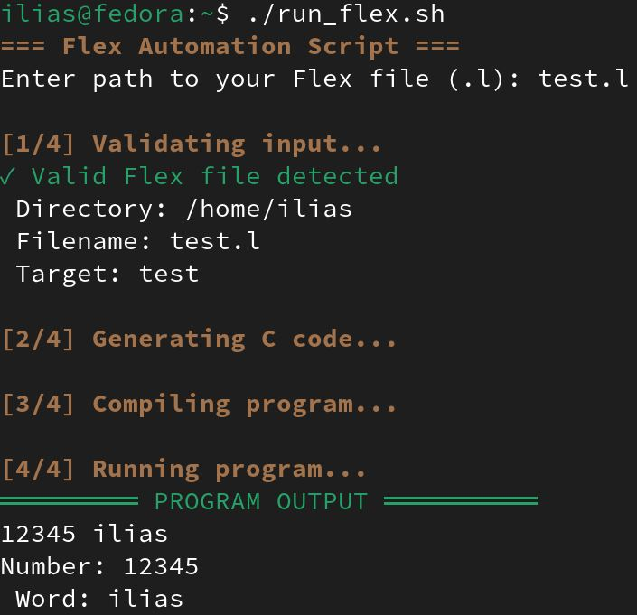

# Flex Automation Script

A Bash script to automate the compilation and execution of Flex (Lex) programs.

## Description

This repository contains a Bash script (`run_flex.sh`) that simplifies the process of compiling and running Flex lexical analyzer programs. It automatically:
1. Validates the Flex file
2. Generates C code from the Flex file
3. Compiles the executable
4. Runs the program

Includes a sample Flex file (`test.l`) that detects numbers and words.

## Prerequisites

- **Flex** (Lexical analyzer generator)
- **GCC** (C compiler)
- Linux/macOS environment (tested on Fedora)
